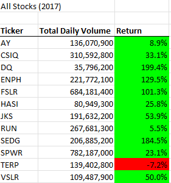
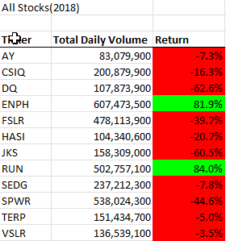

# Stock Analysis Tool - Data Analysis and Refactor

## Purpose

This repository contains a tool designed in Excel with VBA for consumption of stock ticker data and calculation of annual metrics on total trading volume and percentage return in 2017 and 2018.  Intent of the project is twofold:
* Conduct analysis of stock data calculated by the tool.
* Demonstrate the impact of a refactor in significantly reducing burden in a small data set before scaling to accomodate larger data sets.  The original design, while accurate, already showed signs of slowness in a small data set.

## Tool

The tool is built to consume tabular data featuring the following data points:
* Stock ticker
* Trading Date
* Daily prices - Open/High/Low/Closing/AdjustedClosing
* Trading volume

Tabular data is stored in Excel spreadsheet (vba_challenge.xlsm), with data being separated by year with a corresponding name for each worksheet.  Macros attached to the spreadsheet are built to:
1. Prompt user for year input to determine data set for analysis
2. Identify all tickers in data set (NOTE: This currently hardcoded to anticipate exactly 12 tickers.  The original design hardcoded these tickers but was refactored early in development to procedurally identify the tickers from the data set.)
3. Iterate over full data set and identify the following attributes per ticker:
    * Starting price
    * Ending Price
    * Aggregate trade volume
4. Calculate annual return by comparing start and end price
5. Write ticker name, aggregate trade volume, and annual return for each ticker to the All Stocks Analysis sheet in the same workbook
6. Apply conditional formatting for legibility

## Design

### Original

Original design is contained in the Module 1 subroutine `allStockAnalysis()`.  The below snippet contains the original design for the process of iterating through each ticker described above in steps 3 through 5.  Design iterates for each ticker in the `tickers()` array, which contains twelve separate stock tickers.  Within each ticker's respective `for` loop, each row is independently analyzed to see if it contains data related to that ticker, and collects the data if it is true.

```
For x = 0 To 11
    Worksheets(yearValue).Activate
    ticker = tickers(x)
    totalVolume = 0
    
    For y = rowStart To rowend
        If Cells(y, 1).Value = ticker Then
            totalVolume = totalVolume + Cells(y, 8).Value
        End If
    
        If Cells(y, 1).Value = ticker And Cells(y - 1, 1).Value <> ticker Then
            startingPrice = Cells(y, 6).Value
        End If
        
        If Cells(y, 1).Value = ticker And Cells(y + 1, 1).Value <> ticker Then
            endingPrice = Cells(y, 6).Value
        End If
    Next y
            
    Worksheets("All Stocks Analysis").Activate
    Cells(4 + x, 1).Value = ticker
    Cells(4 + x, 2).Value = totalVolume
    Cells(4 + x, 3).Value = (endingPrice / startingPrice) - 1
Next x
```

### Refactor

Refactored design is contained in the Module 2 subroutine `AllStocksAnalysisRefactored()`. Refactor eliminated nested `for` loops in favor of a single loop that iterated over every row only once, identified whether that stock ticker was the same as the previous record, and calculated values accordingly.

```
''2b) Loop over all the rows in the spreadsheet.
For i = 2 To RowCount

    '3a) Increase volume for current ticker
    tickerVolumes(tickerIndex) = tickerVolumes(tickerIndex) + Cells(i, 8).Value
    
    '3b) Check if the current row is the first row with the selected tickerIndex.
    If Cells(i, 1).Value = tickers(tickerIndex) And Cells(i - 1, 1).Value <> tickers(tickerIndex) Then
        tickerStartingPrices(tickerIndex) = Cells(i, 6).Value
    End If
    
    '3c) check if the current row is the last row with the selected ticker
    If Cells(i, 1).Value = tickers(tickerIndex) And Cells(i + 1, 1).Value <> tickers(tickerIndex) Then
        tickerEndingPrices(tickerIndex) = Cells(i, 6).Value
        '3d Increase the tickerIndex.
        tickerIndex = tickerIndex + 1
    End If
        
Next i
```
## Data Analysis

### Results




### Observations

2017 and 2018 are a study in contrasts for stock performance.  2017 saw all but one stock showing positive performance, with four stocks at least doubling in value in that year.  2018 saw significantly worse performance, for reasons that we cannot infer from the data set.

Trading volume comparisons in 2017 and 2018 do not appear to demonstrate any correlation between annual volume and stock performance.

In terms of individual stocks, ENPH stands out as a star performer in return, having doubled in value in 2017 and nearly repeating the feat the following year.

DQ saw most dramatic downward swing in return. Daily volume does not appear to have an impact on performance.

### Data limitations / Opportunities for further analysis

Data set does not contain any additional metrics regarding individual companies, or third party analyses of their performance in a given time period, so the analysis is limited in ability to infer potential causes of stock performance.  
Data set also does not contain broader indices or comparision benchmarks to the green energy industry broadly (i.e. NASDAQ Clean Edge Energy Index Fund) or the economy as a whole (i.e. S&P 500).  Comparison with these benchmarks could help contexualize analysis.

Given the existence of mid/high/low daily prices in the data set, the data contains a possibilty for future studies of intraday price volatility and its potential effect on daily trading volume.

## Refactoring

### Benefits and risks

Refactoring of complex analytical calculations is often mandatory given a large or growing data set.  The larger the data's volume and the more complex the required calculations are, the more that inefficient code can contribute to slowness and even full process failure by way of timeouts.

In other cases, refactors can assist legibility and maintainability, and allow for expansion of existing functionality to include new use cases.

Primary risk of refactor is the addition of new unintended defects based on a failure to understand algorithm in full or misundertanding of how the current design affected edge casess.  Without sufficient testing in place, refactors can easily create new undetected failures and introduce further technical debt.

### Refactor Performance Testing Methodology

Time is recorded for full execution of both versions of the code using the VBA `Timer` function, which is called at the beginning and end of the subroutines to establish total duration.

Time for each was run three times, for both subroutines, with the year 2017 applied (operating assumption is that specified year does not matter as the data sets are roughly identicial).  The third time recorded for each data set was considered a 'stable' run and representative sample of expected performance.

### Refactor Performance Testing Hypothesis and Outcome

Reduction of `for` loops reduces number of row processing events in the affected code by 91.67%.  Assuming a linear value for processing, this should reduce overall burden of the affected code above by a similar percentage.  When accounting for other processing occurring outside of the refactored code, we should expect the overall improvement percentage to be somewhat below that figure of 91.67%.

* Original version - 0.5429688 seconds
* Current version - 0.0878706 seconds

In reality, the refactor has led to a reduction in execution time of **83.8%**, which aligns with the above assumptions.

## Limitations of current design / Opportunities for future refactors

Design of current framework is built on major assumptions about value of data, including:
* Design assumes sequential data, ordered by stock ticker and date.
* Design assumes a fixed quantity of stock tickers (12 total)

Test framework is limited due to reliance on manual execution of subroutines to test their performance, and resultant small sample size.  For more accurate or robust data set, it is possible to build a data testing subroutine within the existing test framework by doing the following:

* Parameterize existing functions by adding ability to call `AllStocksAnalysisRefactored()` with a year value.
* Build `for` loops in new subroutine to test *x* years with *y* times repeated, generating multiple run times for a specific run type.
* Persist the data from these runs on the spreadsheet by adding a print function to end of existing methodologies.
* Calculate central tendency in sheet to assess possible fluctuation/variability both between individual runs of the same subroutine/dataset, as well as between different data sets.
* Calculate overall percentage difference between run types

Data set is fairly small at just over 3,000 records in each year's data set.  Larger data sets would be required for more robust performance tuning.
